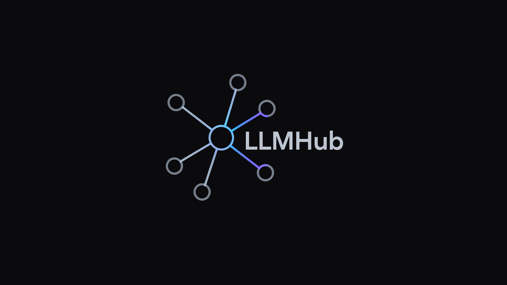

<p align="center">
  
</p>

<h1 align="center">LLMHub</h1>

<p align="center">
  Lightweight gateway for routing LLM requests across providers.
</p>

<p align="center">
  
  
  
</p>

---

## Overview

**LLMHub** is a lightweight infrastructure layer that routes chat requests between multiple LLM providers.

It provides a **single API and CLI interface** to:

* switch between providers
* optimize cost and latency
* run locally or in production

Designed for developers building AI-powered apps without vendor lock-in.

---

## Features

* **Single `/chat` endpoint** powered by FastAPI
* **Multi-provider routing** (Gemini, Ollama, optional OpenAI)
* **Auto routing** via rules or LLM-based agent
* **CLI for local workflows**
* **.env-based configuration**
* **Fallback handling & latency tracking**
* **Business-friendly monitoring dashboard** at `/monitoring/dashboard`
* **Operational monitoring APIs** (`/monitoring/overview`, `/monitoring/timeseries`, `/monitoring/failures`)

---

## Quick Start

### 1. Install

```bash
pip install -r requirements.txt
```

### 2. Configure

```bash
cp .env.example .env
```

Fill required keys.

### 3. Run server

```bash
uvicorn app.main:app --reload
```

Docs available at:

```
http://127.0.0.1:8000/docs
```

---

## Example Request

```json
{
  "message": "Hello",
  "preferred_provider": "auto",
  "max_cost_tier": "low",
  "timeout_ms": 120000
}
```

## Example Response

```json
{
  "answer": "string",
  "provider": "gemini",
  "model": "string",
  "latency_ms": 120,
  "request_id": "uuid",
  "fallback_used": false
}
```

---

## CLI

Install:

```bash
pip install -e .
```

Usage:

```bash
llmhub chat "Hello" --provider auto
llmhub serve --reload
```

---

## Routing Modes

### `rules`

* Fast
* Deterministic
* Based on heuristics

### `agent`

* Uses LLM (Gemini) for routing decisions
* More flexible, but adds latency and cost

---

## Configuration

Environment variables:

* `GEMINI_API_KEY`
* `GEMINI_MODEL`
* `OLLAMA_BASE_URL`
* `OLLAMA_MODEL`
* `ROUTER_MODE`
* `ROUTER_MODEL`

> `.env` must not be committed

---

## Troubleshooting

* **Ollama 404**

  ```bash
  ollama pull llama3:8b
  ```

* **Gemini 404**

  * Check available models via API

---

## Monitoring

Run service and open:

```
http://127.0.0.1:8000/monitoring/dashboard
```

Key endpoints:

* `/metrics` - Prometheus scrape endpoint
* `/monitoring/overview` - KPI snapshot for selected time window
* `/monitoring/timeseries` - request/error/latency series for charting
* `/monitoring/failures` - latest failed requests list

---

## Roadmap

* [ ] OpenAI provider stabilization
* [ ] Request caching
* [ ] Metrics dashboard
* [ ] Rate limiting
* [ ] Plugin system

---

## License

MIT
